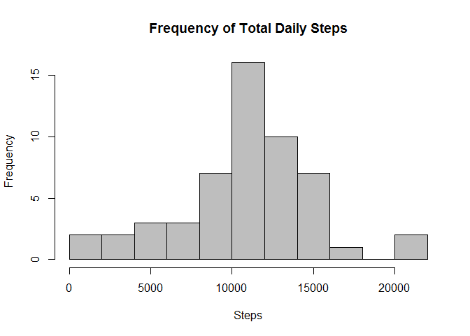
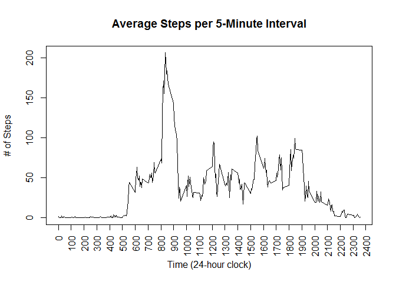
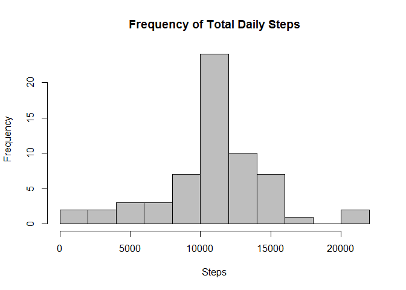
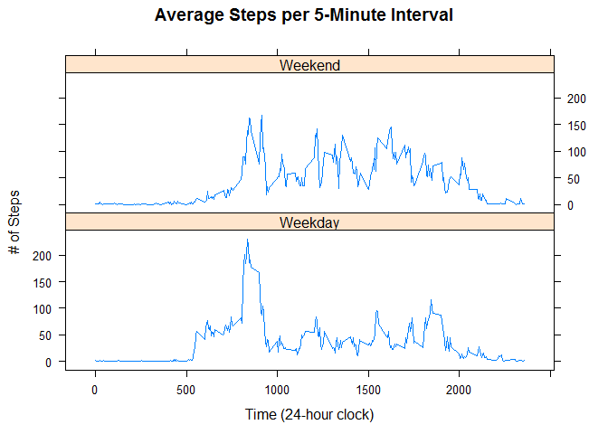

# Reproducible Research: Peer Assessment 1
**Mike O'Connor**

## Loading and preprocessing the data

To load the data, we must first extract it from the .zip file. Then we can read the .csv file. We will also load the lattice library now for use in the rest of the document.

```r
library(lattice)

unzip("activity.zip")

data <- read.csv("activity.csv", colClasses=c("integer","Date","integer"))
```
***
## What is mean total number of steps taken per day?

First, we aggregate the data into the total number of steps per date. We then create a histogram to show the frequency of total daily steps. 

```r
steps <- aggregate(steps ~ date, data = data, sum)

hist(steps$steps, breaks=10, main="Frequency of Total Daily Steps", xlab="Steps", col="gray")
```

 

We can use the histogram to see an estimated mean and median number of total daily steps. Or we can use the mean() and median() functions to calculate the exact values.

```r
mean(steps$steps)
```

```
## [1] 10766.19
```

```r
median(steps$steps)
```

```
## [1] 10765
```
***
## What is the average daily activity pattern?

To find the average daily activity, we need to start by aggregating the data by average number of step per time interval. With the aggregated data, we will create a line graph.

```r
time <- aggregate(steps ~ interval,data=data,mean)

plot(time$interval,time$steps,type="l",xlim=c(0,2355),main="Average Steps per 5-Minute Interval",
     xlab="Time (24-hour clock)", ylab="# of Steps", xaxt="n")
axis(1, at = seq(0, 2400, by = 100), las = 2)
```

 

You can see from the line graph that the highest average number of steps happens at some time between 800 and 900. We can find the exact time interval using the which.max() function.

```r
time[which.max(time$steps),]
```

```
##     interval    steps
## 104      835 206.1698
```
***
## Imputing missing values

In the original data, there were several time intervals that were missing a step count.

```r
nrow(data[is.na(data$steps),])
```

```
## [1] 2304
```

We will correct this by inserting the average number of steps for that time interval that we calculated previously. We will create a new dataset with the inserted averages.

```r
comp <- data

comp$steps[is.na(comp$steps)] <- time$steps[match(time$interval,comp$interval)]

nrow(comp[is.na(comp$steps),])
```

```
## [1] 0
```

Next, we will aggregate the complete data to get the total number of steps by date. Then we create a histogram, find the mean and median in order to see if there is any difference to the incomplete data we used priviously.

```r
comp.steps <- aggregate(steps ~ date, data = comp, sum)

hist(comp.steps$steps, breaks=10, main="Frequency of Total Daily Steps", xlab="Steps", col="gray")
```

 

```r
mean(comp.steps$steps)
```

```
## [1] 10766.19
```

```r
median(comp.steps$steps)
```

```
## [1] 10766.19
```
***

## Are there differences in activity patterns between weekdays and weekends?

Finally, we will determine whether there is more activity on weekdays or weekends. We start by adding a column to the dataset that identifies where the date falls in the week.

```r
comp$weekday <- ifelse(weekdays(comp$date) == "Saturday" | weekdays(comp$date) == "Sunday", "Weekend", "Weekday")
```

Then we will aggregate the data to find the average number of steps per 5-minute interval between weekdays and weekends. Using that aggregated data, we will make a multi panel line graph to see if there is a difference.

```r
comp.time <- aggregate(steps ~ interval+weekday,data=comp,mean)

xyplot(steps ~ interval | weekday, data = comp.time, type = "l", layout = c(1,2), ylab = "# of Steps",
       xlab = "Time (24-hour clock)", main = "Average Steps per 5-Minute Interval")
```

 

As we can tell from the graphs, people take a higher average number of steps during weekday mornings, but are more active through out the day on weekends.
